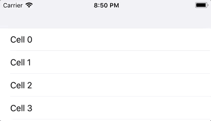

# ScreamRefreshControl

ScreamRefreshControl enables easy visual customisation of the iOS UIRefreshControl (aka Pull To Refresh).

It also provides an implementation inspired by Apple's modern activity indicator.



## Usage

### Using ModernRefreshControl
Use `ModernRefreshControl` in exactly the same manner you would `UIRefreshControl`.

```swift
scrollView.refreshControl = ModernRefreshControl()
scrollView.refreshControl?.addTarget(self, action: #selector(ViewController.didPullToRefresh), for: .valueChanged)
```

You can customise the color by setting `tintColor` directly; or you can do this across your app using `UIAppearance`:

```swift
ModernRefreshControl.appearance().tintColor = customColor 
```

### Customisation
To provide your own appearance for a refresh control, subclass `ScreamRefreshControl` and overide the following:

```swift
open func updateTriggerProgress(_ progress: Float)
open func beginRefreshAnimation()
open func endRefreshAnimation()
```

Refer to [ModernRefreshControl.swift](Source/ModernRefreshControl.swift) for an example

## Setup
The ScreamRefreshControl target builds a swift static library; integrate it into your project as you would any static library.

- Add ScreamRefreshControl.xcodeproj to your project
- Add the ScreamRefreshControl target to your projects 'Target Dependencies' and 'Link Binary With Libraries' Build Phases.
